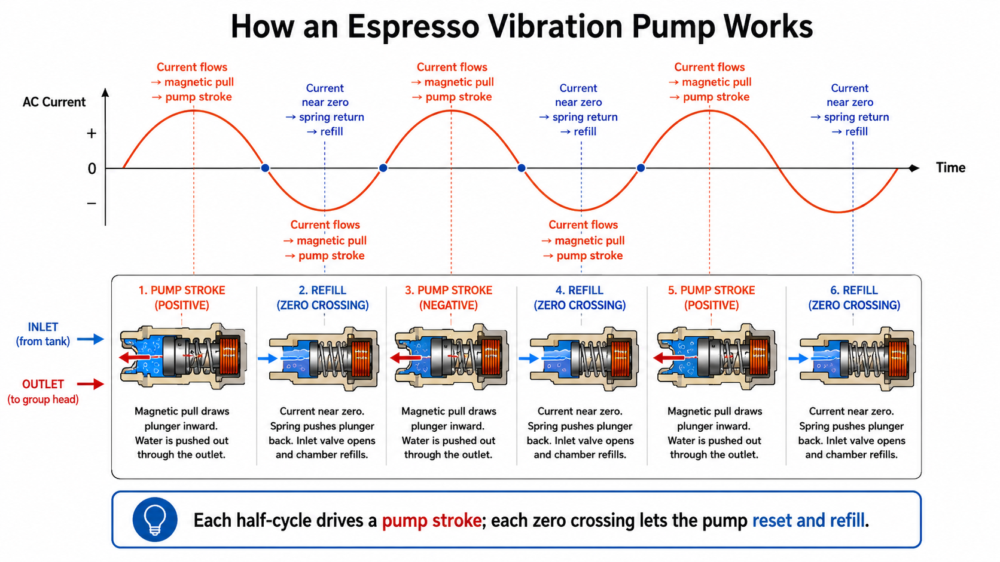
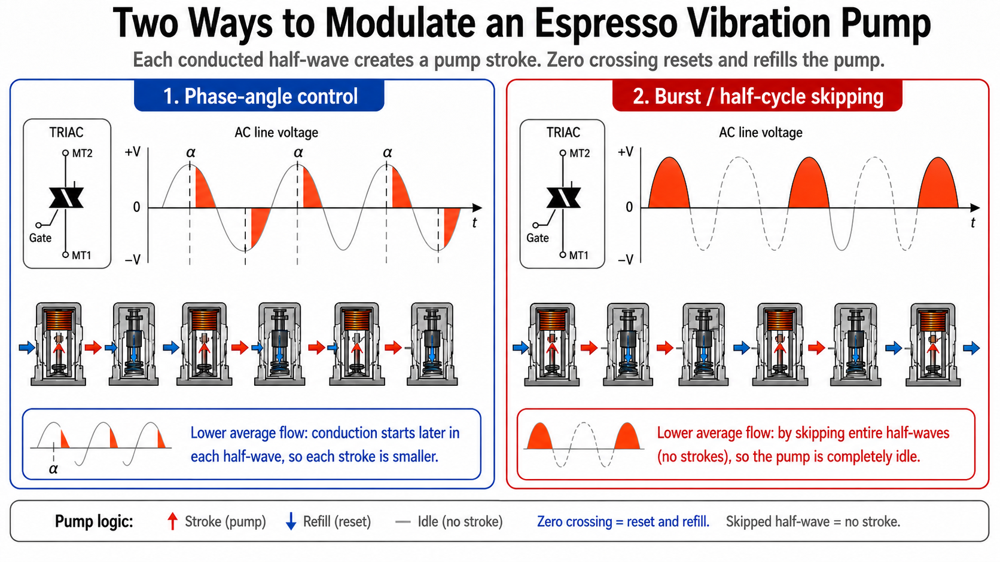
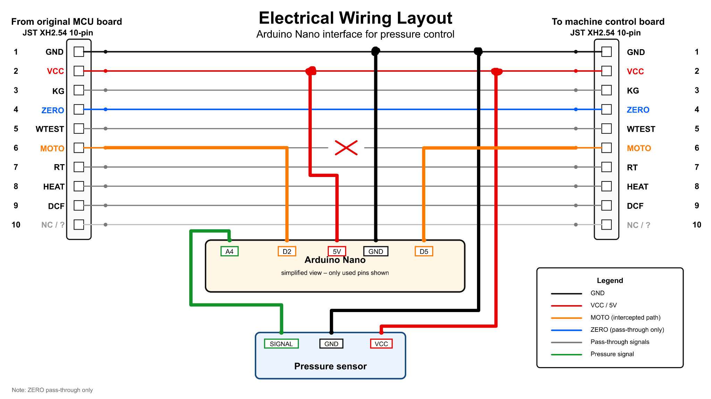
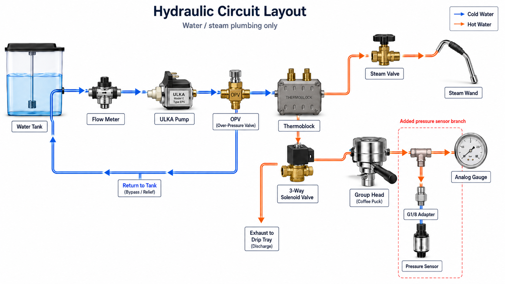

# HiBREW H10A Plus Pressure Control Mod


## DANGER: non-isolated low-voltage electronics

**Do not connect the Arduino USB cable to a computer while the espresso machine is powered from mains.**

The tested machine does not provide a proven safe isolation barrier between the low-voltage control electronics and the mains-powered circuitry. Treat every internal signal as potentially unsafe when the machine is plugged in.

```text
SAFE upload/debug state:
Espresso machine unplugged from mains + Arduino connected by USB

UNSAFE state:
Espresso machine powered from mains + Arduino connected by USB to a PC
```

This also makes live debugging difficult: the firmware is not designed around normal `Serial` debugging while the machine is operating. Testing must be done with the machine unplugged when connected to USB, or by using unplugged/offline inspection methods such as EEPROM logging and carefully planned test runs.

Read the full [Safety](docs/safety.md) page before touching the machine.


An experimental Arduino Nano modification that adds real pressure-feedback control to the HiBREW H10A Plus espresso machine.

The original machine can drive the vibration pump at full power and brew pressure can climb well above 9 bar depending on grind, puck resistance, and flow. This mod adds a 0-12 bar pressure sensor and lets an Arduino Nano intercept the original `MOTO` command before it reaches the machine's original pump power stage.

## What the mod does

The original control board still decides when the machine wants to pump. The Arduino does not replace the coffee machine controller.

Instead, the Arduino acts as a gatekeeper:

1. it reads the original `MOTO` pump command;
2. it reads real brew pressure from an analog pressure sensor;
3. it decides whether to pass or block each pump command;
4. it outputs a modified `MOTO` signal to the original TRIAC/pump power board.

The signal path is:

```text
Original MCU MOTO command
        ↓
Arduino Nano pressure-control gatekeeper
        ↓
Original TRIAC pump power board
        ↓
ULKA vibration pump
```

The TRIAC power board drives the pump. The pump does **not** drive the TRIAC.

## Operating idea

A vibration pump works in strokes. Each conducted half-wave of the AC supply can create a pump stroke; skipping complete half-waves lowers average flow and therefore helps limit pressure.

This project uses burst / half-cycle skipping logic rather than classic phase-angle control. The original `ZERO` signal is currently passed through / available, but the working firmware does not rely on full phase-angle timing.





## Hardware target

- Arduino Nano
- ATmega328P
- 5 V logic
- Direct AVR port access on Port D
- 0-12 bar pressure sensor, 0.5-4.5 V output, 5 V supply
- JST XH 2.54 mm 10-pin connectors for a reversible harness

## Pinout

| Signal | Arduino pin | Purpose |
|---|---:|---|
| Original `MOTO` input | `D2` | Reads the pump command from the original MCU board |
| Modified `MOTO` output | `D5` | Sends the filtered command to the TRIAC/pump power board |
| `ZERO` input | `D3` | Available / pass-through reference, currently not used by the main control logic |
| Pressure sensor output | `A4` | Analog pressure feedback |
| 5 V | `5V` | Arduino and pressure sensor supply |
| Ground | `GND` | Common low-voltage reference |



## Hydraulic layout

The pressure sensor is added on a branch near the group/head pressure gauge side, so the Arduino can regulate pressure based on real hydraulic feedback rather than only estimating pump behavior.



## Firmware notes

The firmware is Arduino/AVR C++, but it intentionally avoids the usual beginner-style Arduino helpers in the timing-critical path.

It uses direct AVR register access instead of relying on functions such as `digitalRead()` and `digitalWrite()` for the fast pump command path. It also avoids `delay()`, `millis()`, and `Serial` in the running control loop because this project needs predictable timing and because live USB serial debugging is unsafe when the machine is connected to mains.

This code was AI-assisted / vibe-coded, but not blindly accepted. The final logic was reviewed line by line, timing-critical sections were kept deliberately small, and AI-generated suggestions were treated as suggestions, not authority. The goal was to give the AI as little freedom as possible around safety-critical and mains-adjacent behavior.

See [Software](docs/software.md).

## Current behavior

Default firmware settings used during testing:

| Setting | Value | Meaning |
|---|---:|---|
| `TARGET_BAR_X10` | `90` | Target pressure = 9.0 bar |
| `HYST_BAR_X10` | `4` | Hysteresis = 0.4 bar |
| `EMA_SHIFT` | `4` | Pressure smoothing strength |
| `MIN_BURST_PULSES` | `2` | Minimum consecutive pulses when pumping |
| `MAX_BLOCKED_PULSES` | `150` | Maximum skipped-pulse streak before a safety burst |

## Bill of materials

Core parts:

- Arduino Nano 5 V / ATmega328P;
- 0-12 bar pressure sensor, 0.5-4.5 V output, 5 V supply;
- JST XH 2.54 mm 10-pin male/female connectors for a reversible harness;
- compatible hydraulic fittings and short PTFE tubes;
- O-rings, seals, heat shrink, insulation, cable ties, and mounting hardware.

See [Bill of materials](docs/bill-of-materials.md).

## Documentation

- [Safety](docs/safety.md)
- [How it works](docs/how-it-works.md)
- [Wiring](docs/wiring.md)
- [Hydraulic layout](docs/hydraulic-layout.md)
- [Software](docs/software.md)
- [Calibration](docs/calibration.md)
- [Testing checklist](docs/testing-checklist.md)
- [Troubleshooting](docs/troubleshooting.md)

## Project status

Experimental working prototype.

This is not a commercial product, not a certified safety modification, and not a beginner electronics project.

## License

MIT License. See [LICENSE](LICENSE).
