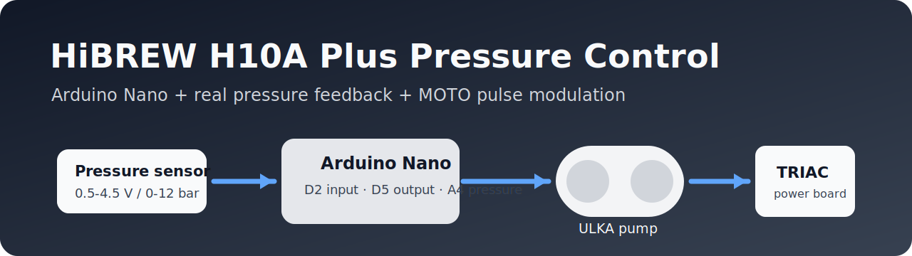
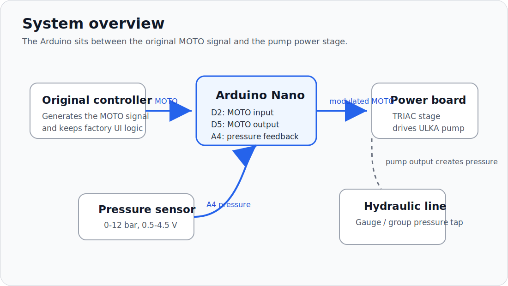
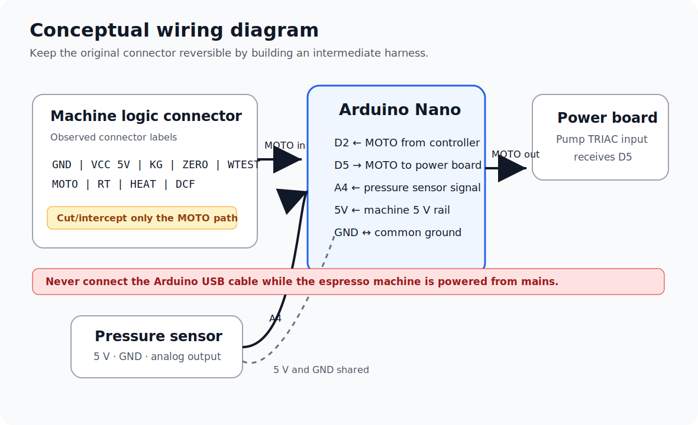
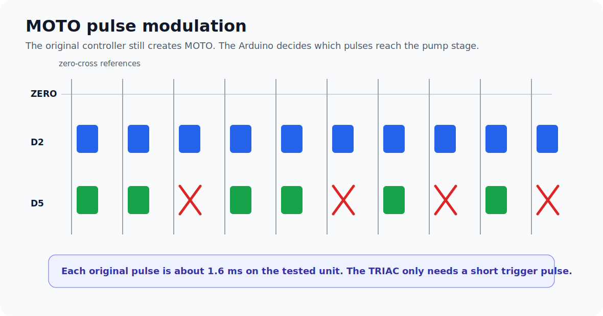

# HiBREW H10A Plus Pressure Control Mod



[](#project-status)
[](firmware/hibrew_h10_pressure_control)
[](LICENSE)
[](docs/SAFETY.md)

An experimental Arduino Nano modification that adds real pressure-feedback control to the **HiBREW H10A Plus** espresso machine.

The mod keeps the original machine controls and firmware behavior, but intercepts the pump command signal and skips selected pump pulses when the measured pressure rises above the target.

> **Read this first:** this project involves an espresso machine connected to **230 V AC mains voltage**, water, heat, and non-isolated electronics risk. It is not a plug-and-play beginner project. See [Safety](docs/SAFETY.md).

## What this project does

The stock machine generates a low-voltage logic signal named `MOTO`, synchronized to the AC waveform, to trigger the pump power stage.

This project adds:

- a **0-12 bar pressure sensor** with 0.5-4.5 V analog output;
- an **Arduino Nano 5 V** inserted between the original `MOTO` signal and the pump power board;
- ultra-fast interrupt-based pass-through on `D2 -> D5`;
- pressure-based pulse skipping near the target pressure;
- fail-open behavior if the pressure sensor reading is out of range;
- pressure filtering to reduce vibration pump pulsation noise;
- safety bursts to avoid leaving the pump fully stopped for too long.

## Project status

**Experimental, working on one tested machine.**

The uploaded firmware is the currently working version tested on a HiBREW H10A Plus unit. Your machine revision, connector layout, PCB, firmware, pressure sensor, fittings, and wiring may differ.

Do not assume compatibility. Verify every connection before powering anything.

## System overview



The Arduino does not replace the original controller. It acts as a fast gate for the original pump command:

```text
Original controller MOTO  ->  Arduino D2
Arduino D5               ->  Pump power board MOTO input
Pressure sensor output   ->  Arduino A4
Machine 5 V and GND      ->  Arduino 5V and GND
```

When pressure is below the control region, the firmware copies all original pulses. When pressure rises near the target, the firmware starts skipping selected pulses.

## Why this mod exists

The HiBREW H10A Plus is advertised with pressure adjustment, but on the tested unit the pressure setting did not behave like true closed-loop pressure control. The machine appeared to affect pump drive behavior rather than regulating the real hydraulic pressure measured near the brew circuit.

With a vibration pump running at full drive, brew pressure can climb well above 9 bar depending on grind, puck resistance, and flow. This mod adds a real pressure sensor and uses that feedback to modulate the pump command.

## Important safety warning

Never connect the Arduino USB cable to a computer while the espresso machine is powered from mains.

```text
Safe upload state:
Espresso machine unplugged from mains + Arduino connected by USB

Unsafe state:
Espresso machine powered from mains + Arduino connected by USB to a PC
```

On the tested unit, the low-voltage electronics may not be safely isolated from mains. A USB connection can create unwanted ground paths and damage the Arduino, the PC, the machine, or worse.

Read the full [Safety](docs/SAFETY.md) page before touching the machine.

## Wiring summary



| Function | Arduino Nano pin | Notes |
|---|---:|---|
| Original MOTO input | `D2` | From the machine microcontroller side |
| Modified MOTO output | `D5` | To the pump power board side |
| ZERO signal | `D3` | Connected but currently not used by the firmware |
| Pressure sensor output | `A4` | 0.5-4.5 V analog output |
| Power | `5V` | From the machine 5 V rail |
| Ground | `GND` | Common low-voltage ground |

Observed connector labels on the tested machine:

```text
GND | VCC 5V | KG | ZERO | WTEST | MOTO | RT | HEAT | DCF
```

See [Wiring](docs/WIRING.md) for details.

## Hydraulic tap


The recommended pressure tap point is the line between the original analog gauge and the brew group. This keeps the original gauge working and gives a pressure reading close to brew circuit pressure.

See [Mechanical installation](docs/MECHANICAL.md).

## Pulse control concept



The tested machine produced short `MOTO` trigger pulses of about **1.6 ms**. The TRIAC power stage only needs a short trigger pulse; once triggered, it remains on until current falls near zero.

The firmware therefore does not generate a new phase-control waveform. It decides whether each original pump trigger pulse should pass or be skipped.

## Firmware

Firmware folder:

```text
firmware/hibrew_h10_pressure_control/
```

Main file:

```text
firmware/hibrew_h10_pressure_control/hibrew_h10_pressure_control.ino
```

Main default parameters:

| Parameter | Default | Meaning |
|---|---:|---|
| `TARGET_CBAR` | `900` | 9.00 bar target |
| `FULL_COPY_UNTIL_CBAR` | `850` | Full pass-through below 8.50 bar |
| `HARD_CUT_CBAR` | `1050` | Aggressive cut above 10.50 bar |
| `HOLD_DUTY_PERMILLE` | `720` | Approximate hold duty near target |
| `KP_PER_CBAR` | `4` | Simplified proportional response |
| `EMA_SHIFT` | `4` | Pressure smoothing strength |
| `MIN_BURST_PULSES` | `2` | Minimum consecutive pulses when pumping |
| `MAX_BLOCKED_PULSES` | `150` | Maximum skipped-pulse streak before safety burst |

See [Software](docs/SOFTWARE.md).

## Bill of materials

See [Bill of materials](docs/BOM.md).

Core parts:

- Arduino Nano 5 V / ATmega328P;
- 0-12 bar pressure sensor, 0.5-4.5 V output, 5 V supply;
- JST XH 2.5 mm 10-pin male/female connectors for a reversible harness;
- compatible hydraulic fittings and short PTFE tubes;
- O-rings, seals, heat shrink, insulation, cable ties, and mounting hardware.

## Documentation

- [Safety](docs/SAFETY.md)
- [Bill of materials](docs/BOM.md)
- [Wiring](docs/WIRING.md)
- [Mechanical installation](docs/MECHANICAL.md)
- [Software](docs/SOFTWARE.md)
- [Calibration](docs/CALIBRATION.md)
- [Testing checklist](docs/TESTING.md)
- [Troubleshooting](docs/TROUBLESHOOTING.md)
- [GitHub setup guide](docs/GITHUB_SETUP.md)

## Suggested repository description

```text
Arduino Nano pressure-control mod for the HiBREW H10A Plus espresso machine.
```

Suggested topics:

```text
arduino espresso coffee pressure-control hibrew h10a-plus vibration-pump ulka triac
```

## Disclaimer

This is an independent experimental project. It is not affiliated with, endorsed by, or supported by HiBREW.

Opening and modifying a mains-powered espresso machine can cause electric shock, fire, water damage, equipment damage, or personal injury. Use this information at your own risk.

## License

Released under the [MIT License](LICENSE).
