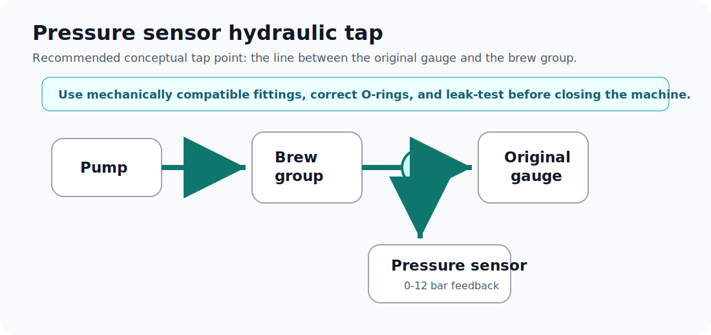

# Mechanical installation



## Recommended pressure tap point

The preferred tap point is the line between the original analog pressure gauge and the brew group. This usually provides a useful reading close to brew circuit pressure while keeping the original gauge functional.

Concept:

```text
Brew circuit / group line -> T-fitting -> original gauge
                                      \
                                       -> pressure sensor
```

## General process

1. Unplug the machine.
2. Open the machine.
3. Identify the tube between the original gauge and the brew group.
4. Add the splitter fitting.
5. Reconnect the original gauge branch.
6. Connect the pressure sensor branch.
7. Use correct O-rings and seals.
8. Route the sensor cable away from heat and moving parts.
9. Run a leak test before closing the machine.

## Leak testing

Test in stages:

1. cold water test;
2. hot machine test;
3. blind basket or pressurized basket test;
4. normal extraction test;
5. final inspection after cooldown.

Look for slow leaks, droplets, pressure loss, and moisture near electronics.

## Sensor fitting warning

Some low-cost pressure sensors have a long threaded section. Some compact fittings have a shallow thread or an O-ring seat that is not compatible with every sensor.

The correct fix is to use a mechanically compatible adapter. Cutting threads, forcing plastic fittings, or using excessive thread tape should not be treated as normal installation practice.

## Mounting the Arduino

Mount the Arduino so it cannot:

- touch the chassis or other electronics;
- move during vibration;
- touch the thermoblock;
- get wet if a fitting leaks;
- short against any connector or solder joint.

A small printed mount, insulated plate, or standoff solution is recommended.
