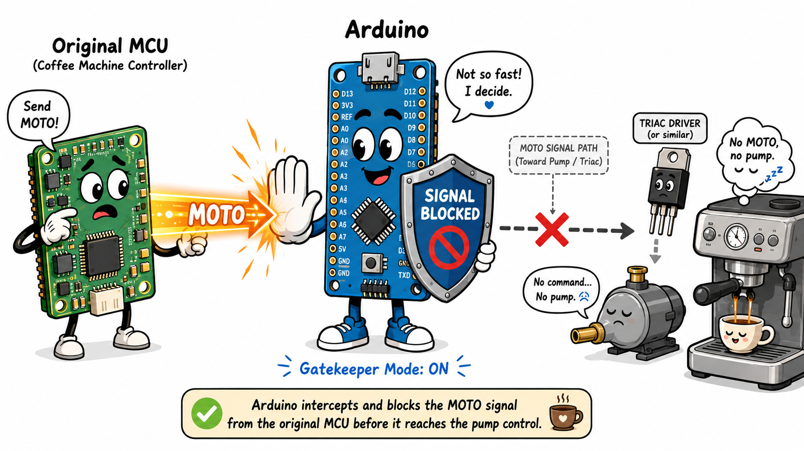

# How it works

## Vibration pump behavior

A vibration pump creates pressure through repeated strokes. In this type of AC-driven pump, each conducted half-wave can create a pump stroke, while each zero crossing lets the plunger reset and the chamber refill.


## Two possible modulation strategies

There are two broad ways to reduce average pump output:

1. phase-angle control, where each half-wave is partly conducted;
2. burst / half-cycle skipping, where complete half-waves are either passed or skipped.

This project uses the second approach.


## Arduino as a gatekeeper

The Arduino sits between the original MCU board and the TRIAC pump power board. It does not generate the whole espresso machine sequence from scratch. It only decides whether the pump command should be allowed through.



## Correct power-chain wording

Correct:

```text
Arduino output -> original TRIAC pump power board -> ULKA pump
```

Wrong:

```text
Arduino output -> pump -> TRIAC
```

The TRIAC board is the actuator power stage. The pump is the load.
